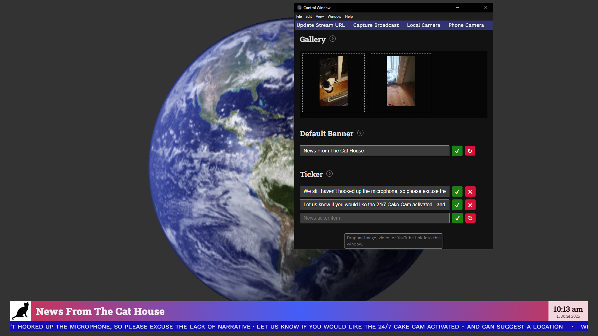
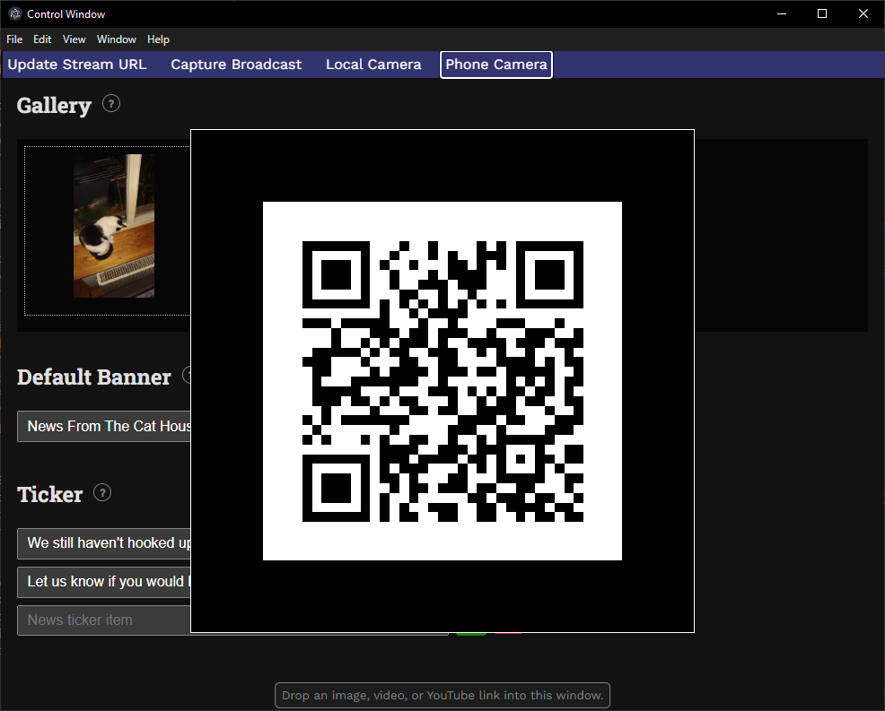

# `home-news-broadcast`

A fun package to make it easy to produce YouTube streams of life at home
for my daughter at college. 

Drop in videos and images or YouTube links, edit the on-screen headlines 
and news ticker, add a stream key, and click to broadcast.

Can be run through Vite or Electron.

## Synopsis

    # Either
    bun it           # Starts Electron including all services
    # Or
    bun dev          # Starts Vite
    bun servers      # and the servers

## Installation

    bun install

## Dependencies

    export YOUTUBE_URL=... # Default stream URL for non-Electron servers

    bun run make-certs # Or put yours in ./certs/

    choco install ffmpeg-full # For  libx264
    
    brew reinstall ffmpeg --with-libx264
    
    sudo add-apt-repository ppa:savoury1/ffmpeg4
    sudo apt update
    sudo apt install ffmpeg

    # Test the ffmpeg setup

    export YOUTUBE_KEY="your-youtube-broadcast-key"
    ffmpeg -re \
      -f lavfi -i testsrc=size=1280x720:rate=30 \
      -f lavfi -i anullsrc=channel_layout=stereo:sample_rate=44100 \
      -c:v libx264 -preset veryfast -tune zerolatency \
      -c:a aac -b:a 128k -ar 44100 -pix_fmt yuv420p \
      -shortest -f flv rtmp://a.rtmp.youtube.com/live2/$YOUTUBE_KEY

### Certs

To use the camera/mic from an external device, you will need to
either used a trusted CA or use `mkcert -CAROOT` to locate the
root CA and install it on the device with a `crt` extension.

### Dev

    bun electron:dev
    bun dev

The above runs Electron pointing to the Vite dev server on the secure port an LAN IP.

To run outside of Electron (as was originally intended):

    bun servers
    bun dev

That will run both the streaming relay server and the WebRTC PeerJS server that otherwise
are started inside Electron.

## Use

1. Drag and drop into the Control Window video files, images, or YouTube video pages.
1. Banner text and ticker can be edited in the Control Screen or on the Broadcast Sreen.
1. Change the banner image by dragging or pasting an image into the Broadcast Window
1. Re-arrange media in the gallery, and edit their title/subitle, using the controls shown when hovering.
1. In the broadcast window, switch between the images in real-time using the cursor keys
1. Connect a remote phone camera using the QR code shown through  the Control Screen menu.
1. Initiate broadcast to YouTube after setting the stream key using the Control Screen menu.

